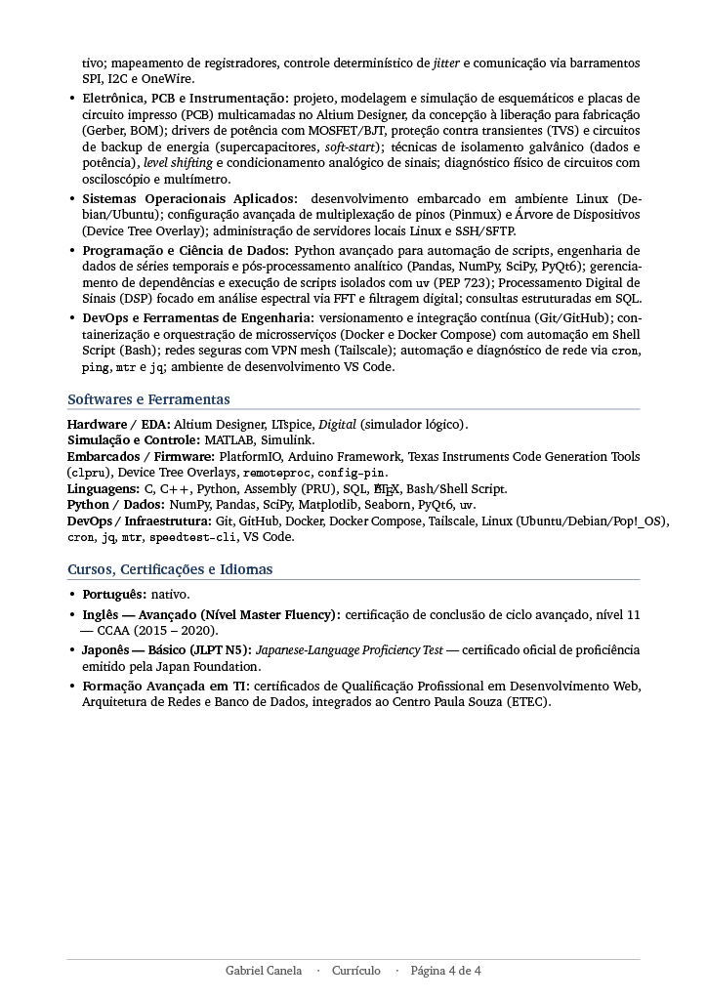

# Resume
Um repositório para armazenar meu currículo em diferentes formatos, no geral em código Latex.

Currículo Geral (Com tudo que posso colocar, e formato amigável para ATS)

<p align="center">
  
  
  
  
</p>

<p align="center">
  
  
</p>


## Como compilar o Currículo Moderno (`cv_moderno.tex`)

Este modelo utiliza fontes nativas do sistema (Lato e Montserrat) e elementos visuais avançados. Para garantir a mais alta qualidade tipográfica e evitar erros de pacotes ausentes — priorizando um ambiente robusto, mesmo que exija um pouco mais de espaço em disco —, recomenda-se a instalação completa do ambiente TeX.

### 1. Preparação da Imagem
Antes de compilar, crie uma pasta chamada `assets` no mesmo diretório do arquivo `.tex` e adicione uma foto de rosto, com proporção quadrada (mínimo de 800x800px), nomeada exatamente como `foto_perfil.png`.

### 2. Instalação das Dependências

**No Linux (Pop!_OS / Ubuntu):**
Abra o terminal e instale o pacote completo do TeX Live e as fontes necessárias:
```bash
sudo apt update
sudo apt install texlive-full fonts-lato fonts-montserrat
```

**No Windows:**
Recomenda-se a instalação do [TeX Live](https://tug.org/texlive/) completo (ou a versão completa do MikTeX). As fontes [Lato](https://fonts.google.com/specimen/Lato) e [Montserrat](https://fonts.google.com/specimen/Montserrat) devem ser baixadas e instaladas manualmente no sistema (clique com o botão direito nos arquivos `.ttf` baixados e selecione "Instalar para todos os usuários").

### 3. Compilação
É obrigatório o uso do motor **XeLaTeX** devido à renderização das fontes do sistema. Além disso, o arquivo deve ser compilado **duas vezes seguidas** para que a barra lateral, o recorte da imagem e as cores de fundo sejam calculados e alinhados perfeitamente na página.

No terminal (seja no Linux ou Windows), navegue até a pasta onde o projeto está salvo e execute:
```bash
xelatex cv_moderno.tex
xelatex cv_moderno.tex
```
Após a execução, o arquivo `cv_moderno.pdf` será gerado com máxima qualidade e estará pronto para uso.